# 数据安全保护伞 (Data Security Umbrella)

数据安全保护伞，专注数据库、API、MQ、日志风险检测及安全防护，提供实时和批量检测能力，支持数据分类分级管理。

## 项目概述

数据安全保护伞是一个全面的数据安全解决方案，旨在帮助企业保护其关键数据资产。系统通过实时监控和批量分析，对数据库、API接口、消息队列和日志系统进行全面的安全检测，并根据数据敏感度进行分类分级，确保数据安全合规。

## 核心功能

### 1. 数据资产安全管理
- **数据库安全管理**
  - 实例监控与管理
  - 数据库安全检测
  - 表级别安全评估
  
- **API安全管理**
  - 域名安全监控
  - API接口风险评估
  - 访问行为分析
  
- **消息队列安全管理**
  - 集群安全监控
  - Topic安全检测
  - 消息内容审计
  
- **日志安全管理**
  - 日志收集与分析
  - 异常行为检测
  - 安全事件告警

### 2. 安全策略管理
- **数据库安全策略**
  - 访问控制策略
  - 数据加密策略
  - 审计日志策略
  
- **API安全策略**
  - 认证授权策略
  - 访问限流策略
  - 数据脱敏策略
  
- **消息队列安全策略**
  - 传输加密策略
  - 访问权限策略
  
- **日志安全策略**
  - 日志保留策略
  - 敏感信息过滤策略

### 3. 检测任务管理
- **实时检测**
  - 实时数据流监控
  - 即时风险告警
  - 动态策略调整
  
- **批量检测**
  - 定期安全扫描
  - 批量数据分析
  - 周期性报告生成

### 4. 数据分类分级
- **自动化分类**
  - 基于内容智能识别
  - 模式匹配分类
  - 机器学习辅助分类
  
- **灵活分级**
  - 敏感度等级定义
  - 自定义分级标准
  - 动态调整机制

## 技术架构

### 前端技术栈
- **框架**: React 19.2.3
- **UI组件**: Ant Design 6.1.1
- **路由**: React Router 7.11.0
- **图标**: Ant Design Icons 6.1.0
- **构建工具**: Create React App

### 后端技术栈
- **框架**: Spring Boot 2.7.0
- **数据库**: MySQL 8.0.33
- **ORM**: MyBatis Plus 3.4.3.1
- **工具**: Lombok 1.18.30

## 系统架构

```
┌─────────────────────────────────────────────────────────────┐
│                      数据安全保护伞系统                      │
├─────────────────────────────────────────────────────────────┤
│  前端展示层 (React + Ant Design)                           │
│  ┌─────────┬─────────┬─────────┬─────────┬─────────────────┐ │
│  │ 资产管理 │ 策略管理 │ 实时检测 │ 批量检测 │ 系统设置        │ │
│  └─────────┴─────────┴─────────┴─────────┴─────────────────┘ │
├─────────────────────────────────────────────────────────────┤
│  业务逻辑层 (Spring Boot)                                  │
│  ┌─────────┬─────────┬─────────┬─────────┬─────────────────┐ │
│  │ 资产管理 │ 策略引擎 │ 检测引擎 │ 分类分级 │ 报告生成        │ │
│  └─────────┴─────────┴─────────┴─────────┴─────────────────┘ │
├─────────────────────────────────────────────────────────────┤
│  数据访问层 (MyBatis Plus)                                 │
│  ┌─────────┬─────────┬─────────┬─────────┬─────────────────┐ │
│  │ 资产数据 │ 策略数据 │ 检测结果 │ 分类结果 │ 日志数据        │ │
│  └─────────┴─────────┴─────────┴─────────┴─────────────────┘ │
├─────────────────────────────────────────────────────────────┤
│  数据存储层 (MySQL)                                         │
│  ┌─────────┬─────────┬─────────┬─────────┬─────────────────┐ │
│  │ 资产库   │ 策略库   │ 结果库   │ 分类库   │ 日志库          │ │
│  └─────────┴─────────┴─────────┴─────────┴─────────────────┘ │
└─────────────────────────────────────────────────────────────┘
```

## 接口开发规范

### ⚠️ 重要限制

本系统后端接口严格遵循以下规范，所有开发者必须遵守：

1. **禁止使用 RESTful 风格**
   - 所有接口统一使用 `POST` 方法
   - 不得使用 `GET`、`PUT`、`DELETE` 等 RESTful HTTP 方法

2. **禁止将参数写在 URL 路径中**
   - 所有参数必须放在请求体（Request Body）中
   - 不得使用路径参数（如 `/api/resource/{id}`）
   - 不得使用查询参数（如 `/api/resource?id=123`）

3. **统一返回格式**
   - 所有接口返回统一的 `Result` 对象
   - 包含 `code`（状态码）、`message`（消息）、`data`（数据）字段

### 接口示例

#### 正确的接口设计
```java
// ✅ 正确：使用 POST 方法，参数在请求体中
@PostMapping("/get-by-id")
public Result<DataSource> getById(@RequestBody Map<String, Object> params) {
    Long id = Long.parseLong(params.get("id").toString());
    DataSource dataSource = dataSourceService.getById(id);
    return Result.success(dataSource);
}
```

#### 错误的接口设计
```java
// ❌ 错误：使用 GET 方法
@GetMapping("/{id}")
public Result<DataSource> getById(@PathVariable Long id) {
    // ...
}

// ❌ 错误：使用 PUT 方法
@PutMapping
public Result<Boolean> update(@RequestBody DataSource dataSource) {
    // ...
}

// ❌ 错误：使用 DELETE 方法
@DeleteMapping("/{id}")
public Result<Boolean> delete(@PathVariable Long id) {
    // ...
}

// ❌ 错误：使用查询参数
@GetMapping("/page")
public Result<IPage<DataSource>> getPage(
    @RequestParam Integer current,
    @RequestParam Integer size) {
    // ...
}
```

### 前端调用示例

```typescript
// ✅ 正确：使用 POST 方法，参数在请求体中
const response = await request('/api/data-source/get-by-id', {
    method: 'POST',
    body: JSON.stringify({ id: 123 }),
});

// ❌ 错误：使用 GET 方法，参数在 URL 中
const response = await request('/api/data-source/123', {
    method: 'GET',
});
```

### 规范原因

1. **安全性**：所有接口使用 POST 方法，减少攻击面
2. **一致性**：统一的接口风格，便于维护和理解
3. **扩展性**：便于接口版本控制和参数扩展
4. **监控**：便于日志记录和请求追踪

## 快速开始

### 环境要求
- Node.js 16+
- Java 8+
- MySQL 8.0+
- Maven 3.6+

### 安装步骤

1. **克隆项目**
   ```bash
   git clone https://github.com/your-org/data-sec-umbrella.git
   cd data-sec-umbrella
   ```

2. **启动后端服务**
   ```bash
   cd data-sec-umbrella-server
   # 在 data-sec-umbrella-server-manager 的 application.yml 中配置数据库
   mvn clean install
   # 管理 API（对接前端，默认 8080）
   mvn -pl data-sec-umbrella-server-manager spring-boot:run
   # 如需定时资产扫描等运行端任务，另起进程（默认 8081）：
   # mvn -pl data-sec-umbrella-server-worker spring-boot:run
   ```

3. **启动前端服务**
   ```bash
   cd data-sec-umbrella-front
   npm install
   npm start
   ```

4. **访问系统**
   - 前端地址: http://localhost:3000
   - 后端API: http://localhost:8080

## 使用指南

### 1. 数据资产管理
- 添加数据库、API、MQ、日志等数据资产
- 配置资产连接信息和访问凭证
- 查看资产状态和安全概况

### 2. 安全策略配置
- 根据业务需求制定安全策略
- 设置检测规则和阈值
- 配置告警通知方式

### 3. 检测任务执行
- 创建实时检测任务，持续监控数据安全
- 配置批量检测任务，定期进行全面扫描
- 查看检测结果和风险报告

### 4. 数据分类分级
- 配置分类规则和分级标准
- 执行自动分类分级任务
- 管理和维护分类分级结果

## 项目结构

```
data-sec-umbrella/
├── data-sec-umbrella-front/          # 前端项目
│   ├── public/                       # 静态资源
│   ├── src/
│   │   ├── components/               # 公共组件
│   │   ├── layouts/                  # 布局组件
│   │   ├── pages/                    # 页面组件
│   │   │   ├── asset/                # 资产管理页面
│   │   │   │   ├── database/         # 数据库管理
│   │   │   │   ├── api/              # API管理
│   │   │   │   ├── message/          # 消息队列管理
│   │   │   │   └── log/              # 日志管理
│   │   │   └── task/                 # 任务管理页面
│   │   │       ├── policy/           # 策略管理
│   │   │       ├── real-time/        # 实时检测
│   │   │       └── batch/            # 批量检测
│   │   ├── utils/                    # 工具函数
│   │   └── App.tsx                   # 应用入口
│   └── package.json
├── data-sec-umbrella-server/         # 后端聚合工程
│   ├── pom.xml                       # 父 POM（依赖版本管理）
│   ├── data-sec-umbrella-server-core/    # 实体、Mapper、Service、工具（无 Controller）
│   ├── data-sec-umbrella-server-manager/ # 管理端 API（Spring Web，默认 8080）
│   └── data-sec-umbrella-server-worker/  # 运行端（定时/MQ 等，默认 8081）
└── README.md                         # 项目说明
```

## 贡献指南

我们欢迎社区贡献！请遵循以下步骤：

1. Fork 本项目
2. 创建特性分支 (`git checkout -b feature/AmazingFeature`)
3. 提交更改 (`git commit -m 'Add some AmazingFeature'`)
4. 推送到分支 (`git push origin feature/AmazingFeature`)
5. 提交 Pull Request

## 许可证

本项目采用 [Apache 2.0 许可证](LICENSE)。

## 联系我们

- 项目主页: https://github.com/JavaScalaDeveloper/data-sec-umbrella
- 问题反馈: https://github.com/JavaScalaDeveloper/data-sec-umbrella/issues
- 邮箱: 544789628@qq.com

## 交互界面展示

交互截图位于 `data-sec-umbrella-front/public/images/交互图/`（按「管理中心」「数据安全保护伞」分子目录）。下面按**推荐落地顺序**串联主要页面；图片路径为相对仓库根目录，便于在 GitHub / 本地预览。

### 1. 管理中心：超级管理员登录与账号配置

超级管理员**账号与密码**在管理端 **`application.yml`**（或等价配置）中预置；仅用于进入「管理中心」，与业务侧登录态分离。完成登录后，可为团队创建 **ADMIN / OPERATOR** 等账号，并绑定 **DATABASE / API / MQ** 等产品权限。

**管理员登录页**：输入预置超级管理员用户名、密码后提交，服务端校验通过后写入管理端会话（前端本地亦会保存令牌，便于刷新后仍保持登录）。

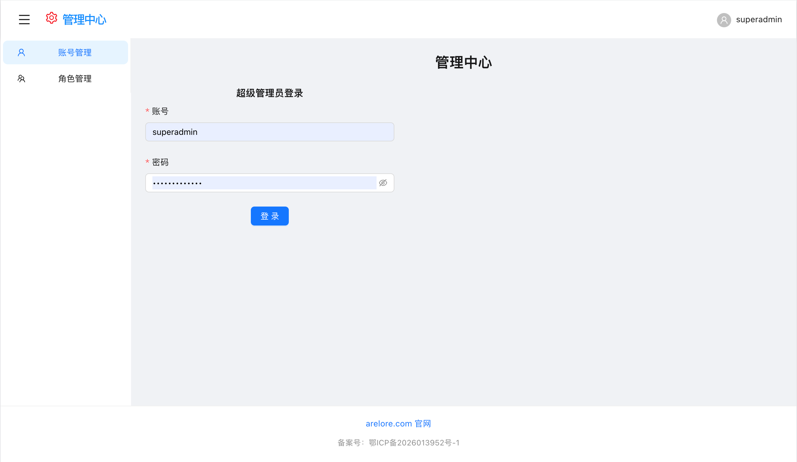

**新建或编辑账号（弹窗）**：填写登录名、初始密码（新建时）、角色代码、多选产品权限及启用状态；超级管理员可维护他人账号，普通管理员仅能做只读或受限操作（以接口权限为准）。

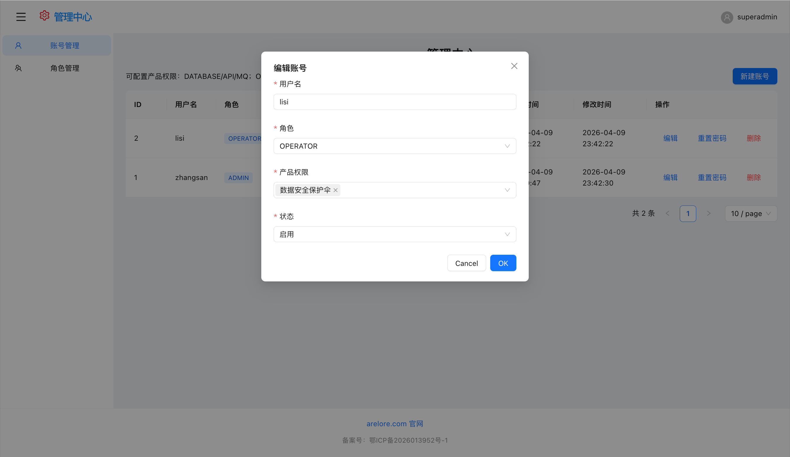

**账号列表**：分页展示已创建账号，可看到角色、产品权限标签、启用/禁用、创建与修改审计字段；支持从列表发起编辑、重置密码或删除（删除需二次确认）。

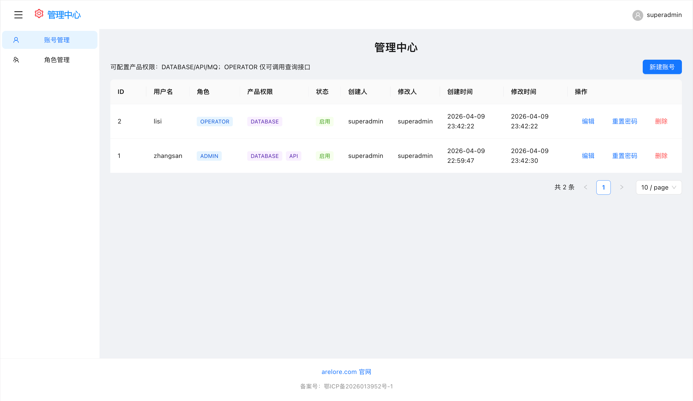

### 2. 策略管理：规则与分类策略

在「数据库安全保护伞 → 策略管理」中按引擎（如 MySQL / ClickHouse）维度维护策略；每条策略对应唯一的 **policy_code**，供离线任务、资产扫描等引用。

**策略列表**：支持按名称、创建人、敏感等级等条件筛选；列表中可快速区分数据库类型、策略启用情况，并进入编辑或删除（删除前需确认无关键任务依赖）。

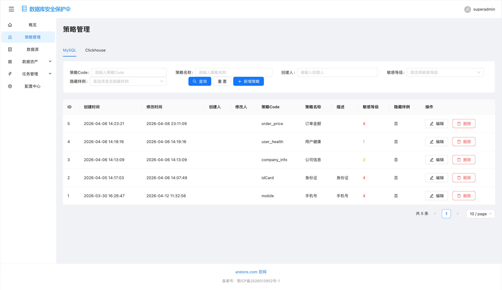

**策略配置（编辑弹窗）**：维护策略名称、描述、敏感等级与「隐藏样例」等基础信息；核心是**多条分类规则**（条件对象、条件类型、表达式、命中比例）以及汇总用的**规则表达式**与 **AI 规则**文本，并可填写样例数据做「规则检测」校验后再保存。

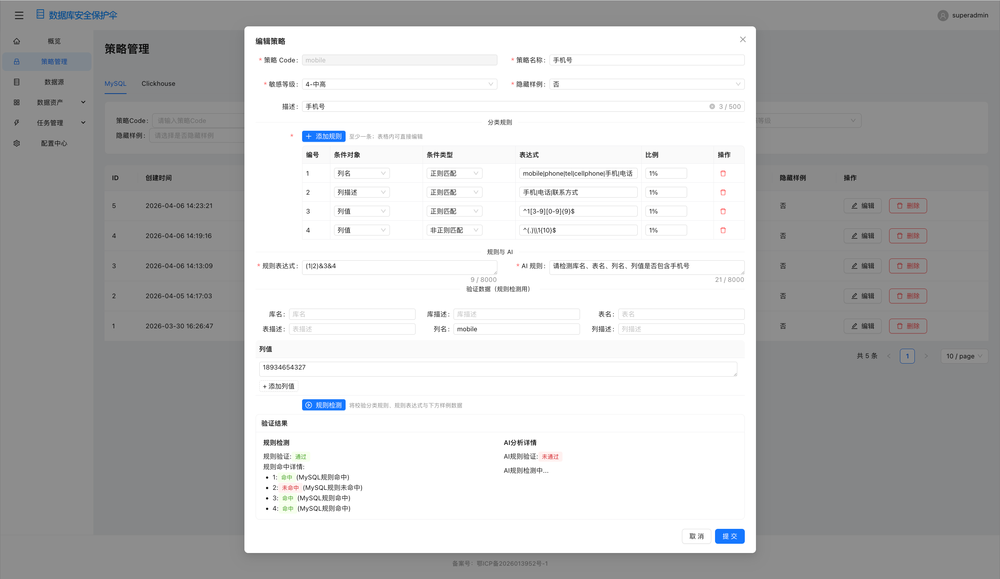

### 3. 数据源与数据资产

先登记可连通的**数据源实例**（连接串、账号、类型等），管理端会探测连通性；资产扫描与离线任务均依赖此处配置，避免在业务页面硬编码连接信息。

**数据源配置（新建/编辑）**：选择数据源类型（如 MySQL、ClickHouse 等）、填写实例地址（`host:port` 形式）、库侧账号密码及说明；保存前可触发「测试连接」确认网络与凭据正确。

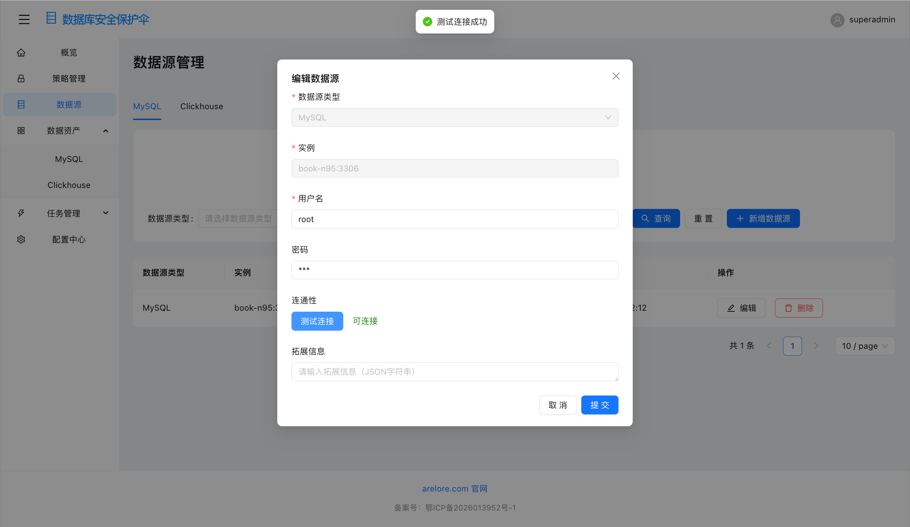

**数据源列表**：按类型与关键字过滤已登记实例，查看连通性状态、创建/修改时间；从列表可再次编辑或作为后续资产发现、扫描任务的选取范围。

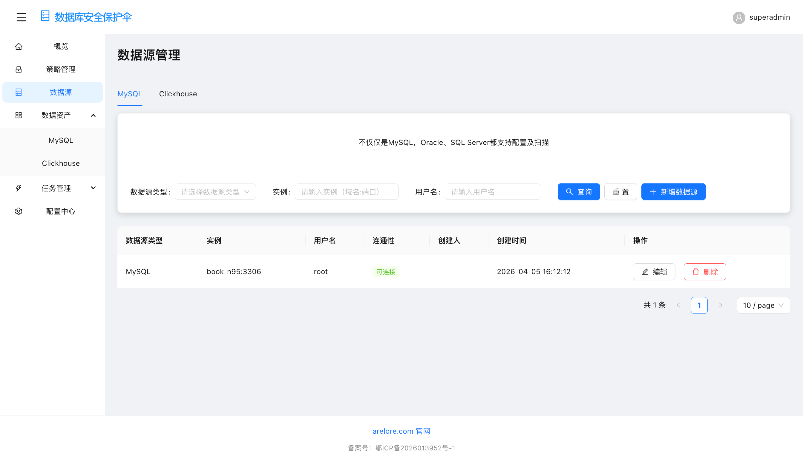

**数据资产 · 实例维度**：以数据源实例为入口浏览其下挂资产规模（库、表数量或健康度等摘要，以后端返回为准），用于确认采集范围是否覆盖预期环境。

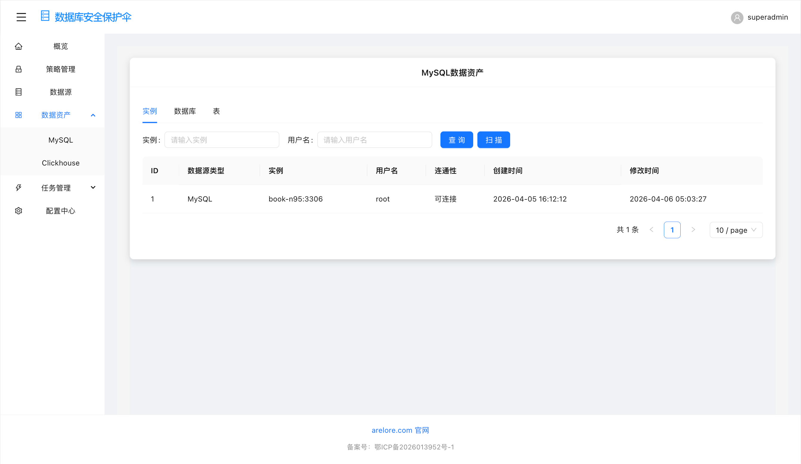

**数据资产 · 数据库维度**：在选定实例下展开数据库列表，查看库名、描述及策略扫描产出的敏感等级、标签等聚合信息，便于先做库级治理。

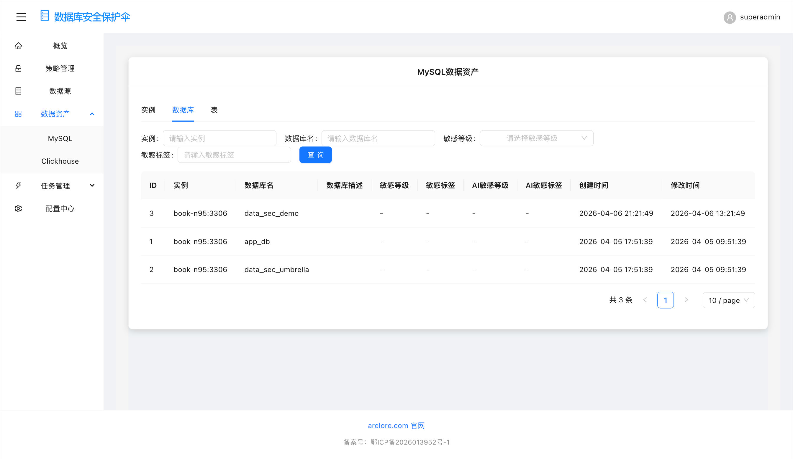

**数据资产 · 表维度**：进一步下钻到表列表，关注单表敏感等级、标签及人工打标状态，为列级审计或抽样扫描提供入口。

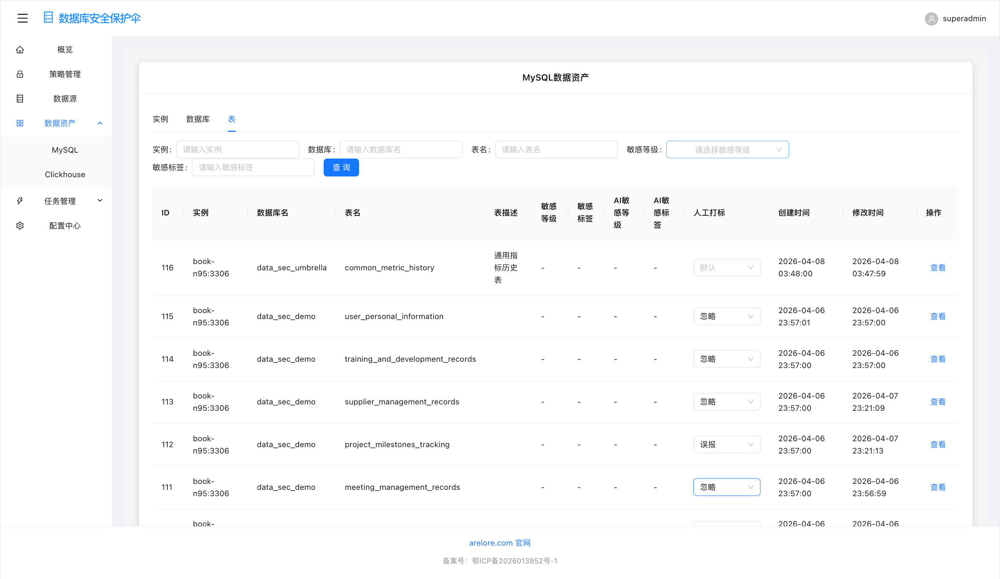

**表详情 · 列级**：在表维度打开详情后，逐列展示数据类型、注释，以及**规则扫描 / AI 扫描**各自的敏感等级、标签与样例片段，支持对单列结论做人工复核。

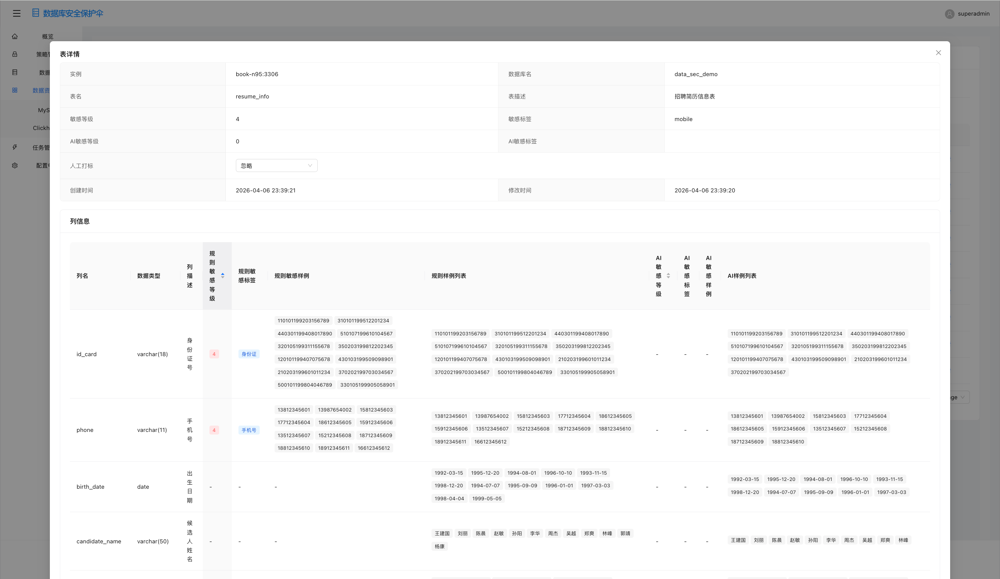

### 4. 批量离线扫描：任务配置

在「任务管理 → 批量任务」中按引擎（MySQL / ClickHouse）分别维护离线扫描任务：任务与调度层共用存储，通过 `database_type` 区分引擎。

**任务列表**：展示任务名、扫描周期、启用状态等；可对单条任务执行「立即运行」生成实例，或停用周期调度，避免误扫生产。

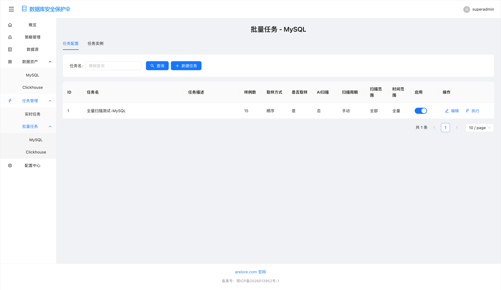

**任务配置（新建/编辑）**：配置采样条数与取样方式、是否启用规则/AI 扫描、扫描范围（全实例或指定实例）、时间窗口（全量/增量）及关联 **policy_code** 列表；保存后由 Worker 按队列消费执行。

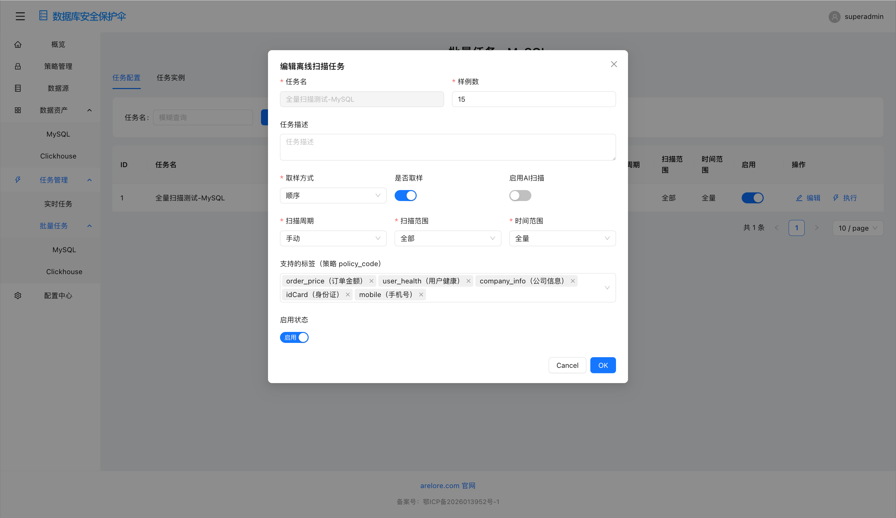

### 5. 执行扫描与查看实例结果

每次「执行」或周期触发会生成一条**任务实例**记录运行进度、成功/失败计数；实例完成后可查看落库的**快照**（表级、字段级事件），用于审计与排障。

**任务实例列表**：按运行状态、任务名过滤实例，查看进度百分比、起止时间；可停止运行中实例或打开详情查看快照与列级 JSON。

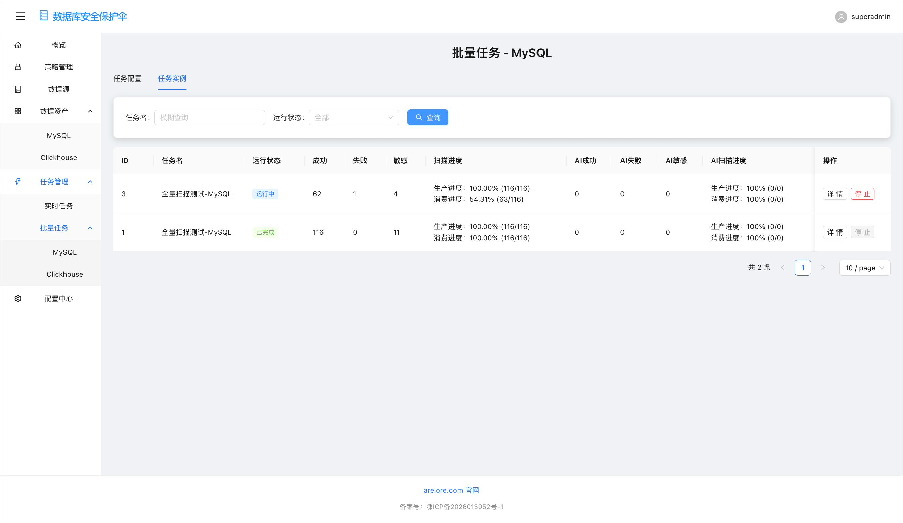

**实例详情 · 快照总览**：在弹窗内切换「表级 / 字段级」快照 Tab，按唯一键、敏感等级、标签等条件过滤；快照数据有保留周期（如表 TTL 约 180 天），超期由存储层清理。

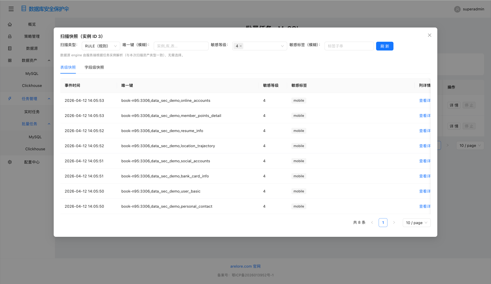

**字段级快照**：展示扫描过程中产生的字段事件（时间、唯一键、敏感标签、样例等），便于对照策略命中情况与具体列值分布。

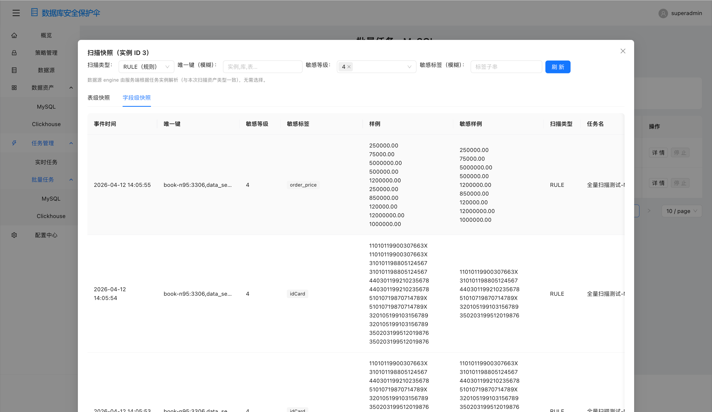

**表级快照中的列详情 JSON**：对单条表级记录可展开「列详情」，查看结构化 JSON（列名、等级、标签、样例列表等），用于与线上一致性比对或导出分析。

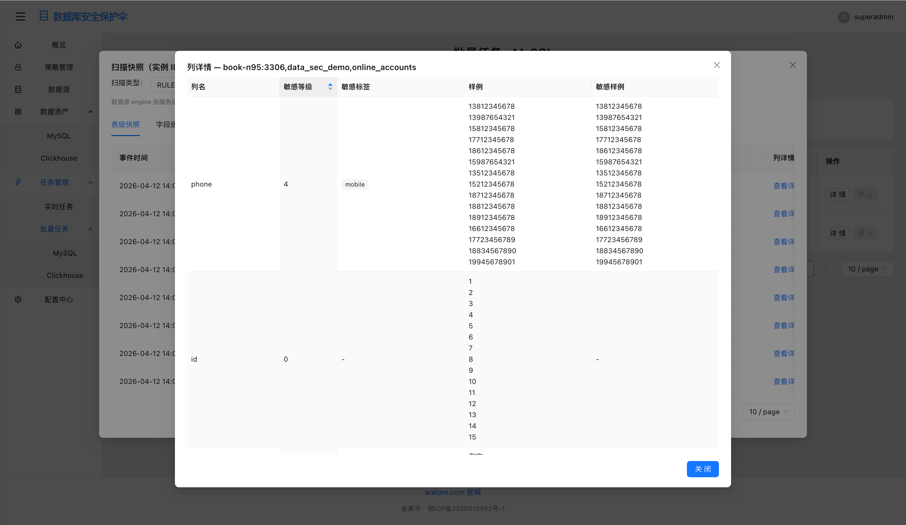

### 6. 大盘概览

**概览页**：在「数据库安全保护伞 → 概览」聚合展示资产体量、扫描覆盖、风险分布等图表与指标（具体卡片以后端统计接口为准），便于管理层快速掌握当前数据安全态势与趋势。

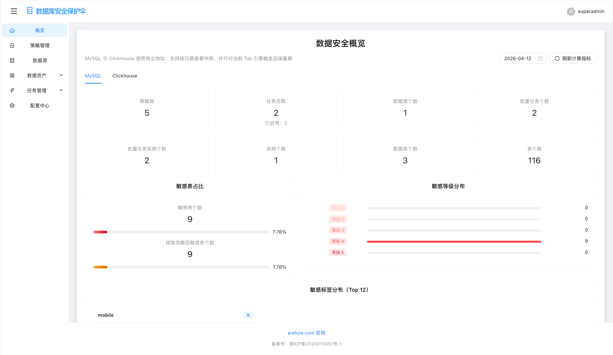

> 入口页与各产品模块总览另见：`data-sec-umbrella-front/public/images/交互图/首页.png`。

## 快速启动脚本

### 前端一键启动

项目提供了便捷的前端启动脚本 `start.sh`，位于 `/data-sec-umbrella-front` 目录下。

#### 使用方法：

1. 进入前端项目目录：
   ```bash
   cd /Users/huang/Documents/Workspaces/data-sec-umbrella/data-sec-umbrella-front
   ```

2. 给脚本添加执行权限（首次使用）：
   ```bash
   chmod +x start.sh
   ```

3. 执行启动脚本：
   ```bash
   ./start.sh
   ```

#### 脚本功能：
- 自动检查 Node.js 和 npm 环境
- 自动安装项目依赖（如果 node_modules 不存在）
- 启动前端开发服务器
- 显示访问地址和停止服务器的方法

## 更新日志

### v0.1.0 (2024-01-01)
- 初始版本发布
- 实现基础的数据资产管理功能
- 支持数据库、API、MQ、日志的安全检测
- 提供实时和批量检测能力
- 实现数据分类分级功能